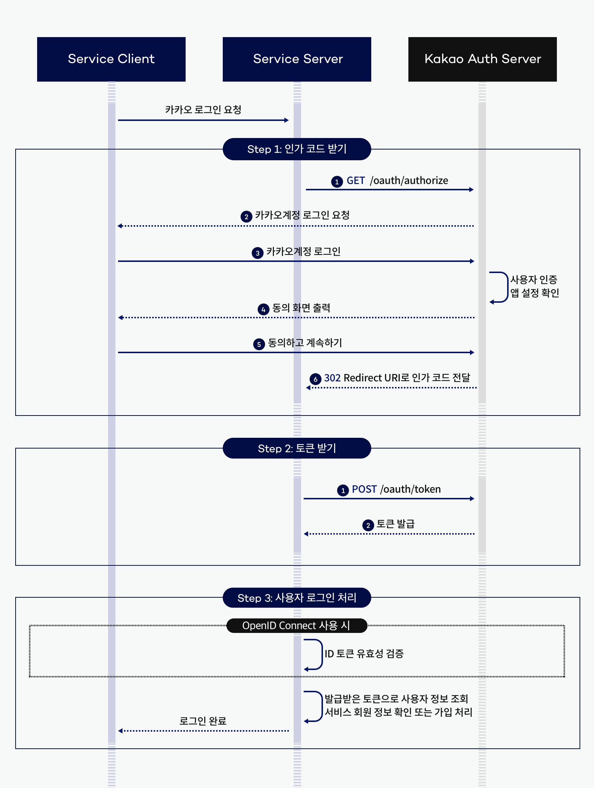

# spring-gift-order

## 0단계 - 기본 코드 준비
- [x] 상품 고도화 코드를 옮겨 온다

## 1단계 - 카카오 로그인
- [ ] 카카오 API를 사용하기 위한 애플리케이션을 등록한다 (https://developers.kakao.com/docs/latest/ko/tutorial/start#create)
- [ ] 등록후 아래 사항들을 설정해준다
  - [ ] 내 애플리케이션 > 제품 설정 > 카카오 로그인 > 활성화 설정 ON (카카오 로그인 활성화 설정) (https://developers.kakao.com/docs/latest/ko/kakaologin/prerequisite#kakao-login-activate)
  - [ ] 내 애플리케이션 > 제품 설정 > 카카오 로그인 > Redirect URI 등록 > http://localhost:8080 저장 (Redirect URI 등록) (https://developers.kakao.com/docs/latest/ko/kakaologin/prerequisite#kakao-login-redirect-uri)
  - [ ] 내 애플리케이션 > 제품 설정 > 카카오 로그인 > 동의항목 > 접근권한 > 카카오톡 메시지 전송 > 선택 동의 (접근권한 동의항목) (https://developers.kakao.com/docs/latest/ko/kakaologin/utilize#scope-feature)
  - [ ] 내 애플리케이션 > 앱 설정 > Web 플랫폼 등록 > http://localhost:8080 저장 (Web) (https://developers.kakao.com/docs/latest/ko/app-setting/app#platform-web)
- [ ] 카카오계정 로그인을 통해 인가 코드를 받는다
- [ ] 인가 코드를 사용해 토큰 발급 요청을 수행한다
- [ ] 토큰 응답에서 액세스 토큰을 추출한다
- [ ] 앱 키, 인가 코드가 유출되지 않도록 한다 (github 유출 X)
- [ ] (선택) 인가 코드 받는 방법이 불편할 경우 카카오 로그인 화면을 구현한다

### 실제 카카오 로그인 진행 방식은 아래와 같다 

### 지금과 같이 클라이언트가 없는 상황에서는 아래와 같은 방법으로 인가 코드를 획득한다
1. 내 애플리케이션 > 앱 설정 > 앱 키로 이동하여 REST API 키를 복사한다.
2. https://kauth.kakao.com/oauth/authorize?scope=talk_message&response_type=code&redirect_uri=http://localhost:8080&client_id={REST_API_KEY} 에 접속하여 카카오톡 메시지 전송에 동의한다.
3. http://localhost:8080/?code={AUTHORIZATION_CODE}에서 인가 코드를 추출한다.